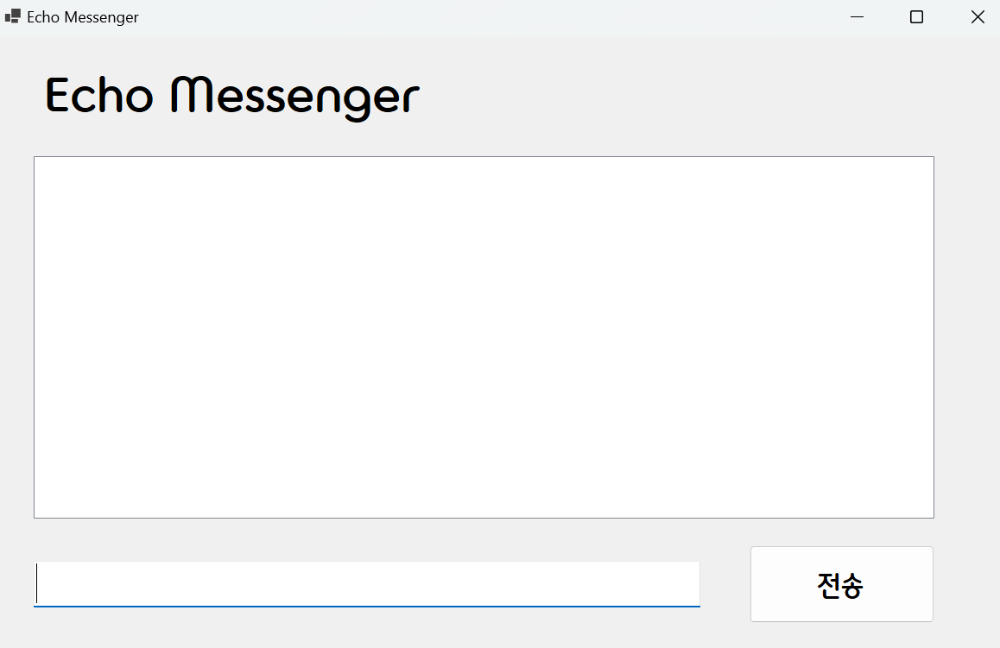
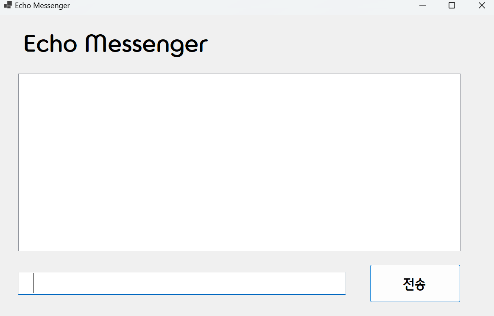

# (C# 코딩) EchoMessenger

## 개요
-C# 프로그래밍 학습
-1줄소개: 텍스트를 입력했을 때 입력했던 내용을 처리하는 프로그램
-사용한 플랫폼: 
  -C#, .NET Windows Forms, Visual Studio, GitHub
-사용한 컨트롤:
  -Label, TextBox, ListBox, Button
-사용한 기술과 구현한 기능:
 -Visual Studio를 이용하여 UI 디자인
 -string 클래스를 이용한 사용자 입력데이터 처리

## 실행화면(과제1)
-과제1코드의실행스크린샷

-과제내용
 -Label, TextBox, Button, ListBox를 적절히 배치 후 글꼴과 글자크기를 수정합니다.
 -전송버튼을 클릭했을 때 ListBox에 TextBox의 내용을 추가합니다.
 -추가직후 TextBox의 내용을 비워(Clear) 다음입력을준비합니다.

-구현내용과기능설명
 -입력창에 메시지를 입력하고 전송버튼을 누르면 내용이 리스트박스에 표시됩니다.
 -추가내용이 많아지면 리스트박스에 스크롤 바가 자동으로 생기고 스크롤이 됩니다.
 (img/스크롤바생김.png)

## 실행화면(과제2)
-과제2코드의실행스크린샷

-과제내용
 -입력창의 기존 메시지 지우기
 -입력창에 입력 포커스 갖다 놓기
 -엔터키로 전송하기
 -입력 방어

-구현내용과기능설명
 -전송을 하였을 때 텍스트박스의 기존 메시지가 삭제됩니다.
 -전송 후에 입력 포커스를 다시 텍스트박스로 돌려놓습니다.
 -엔터키만 눌러도 전송을 할 수 있습니다.
 -빈공간 혹은 공백(스페이스바)만 있을 때 전송이 되지 않도록 합니다.

과제3과 과제4는 시간 부족으로 진행하지 못 했습니다.